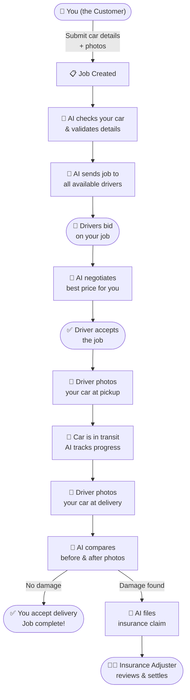
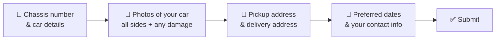
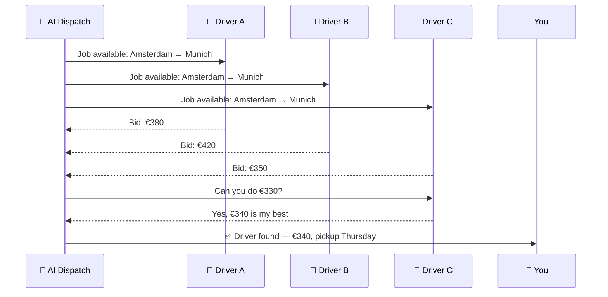
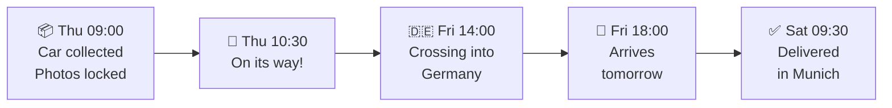
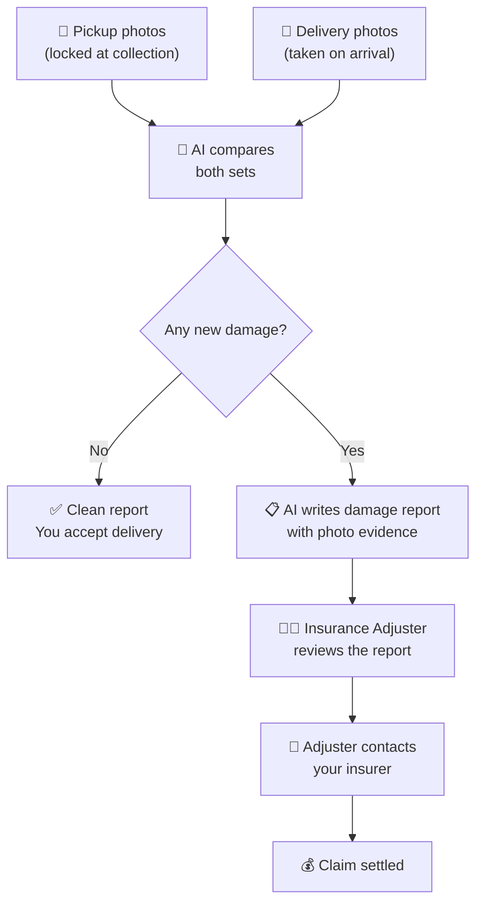
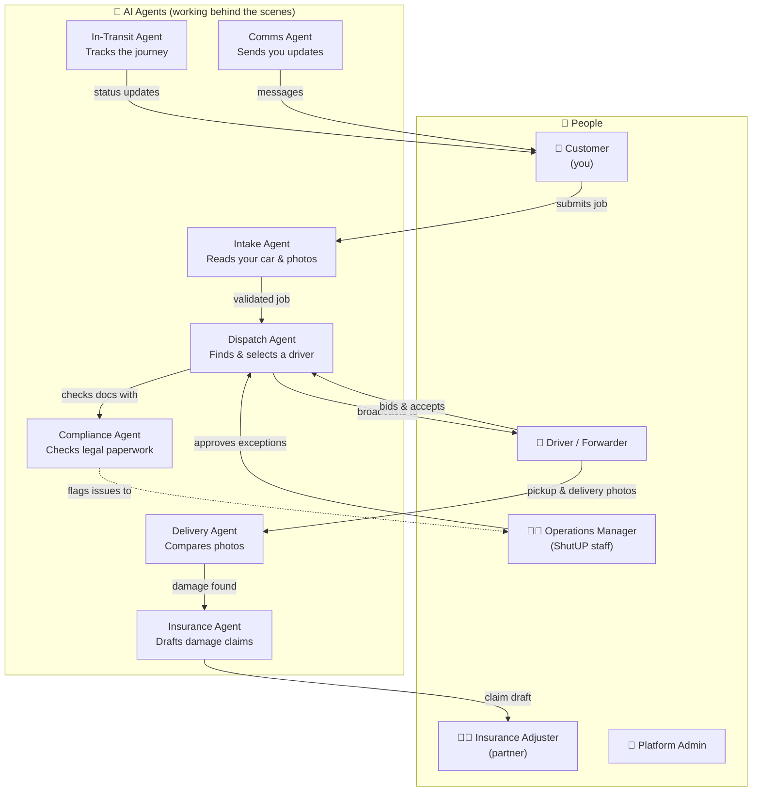
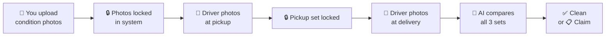

# ShutUP Forwarder — Plain English Guide

> **In one sentence:** You take a photo of your car, tell us where it needs to go, and our AI handles everything else — finding a driver, agreeing on a price, tracking the journey, and making sure your car arrives without new damage.

---

## The Problem We Solve

Moving a car from A to B is surprisingly painful. You have to:

- Find a trustworthy transporter (how do you know they're reliable?)
- Negotiate a fair price (is €400 too much? Too little?)
- Prove the condition of your car *before* it's loaded, so you're protected if something gets scratched
- Chase people for updates during the journey
- Deal with an insurance company if something goes wrong

**ShutUP Forwarder automates all of that.**

---

## How It Works — The Big Picture



---

## What Happens Step by Step

### Step 1 — You Fill In a Simple Form

You tell us about your car and where it needs to go. The app walks you through it:



The AI reads your chassis number automatically (you just point the camera at it), and as you upload photos it **immediately highlights any existing scratches or dents** — so there's a clear record before the car leaves your hands.

---

### Step 2 — AI Finds You a Driver

You don't have to contact anyone. The AI broadcasts your job to our network of verified drivers and handles all negotiation automatically.



The AI knows what a fair price looks like for your route. It won't accept a price that's too high, and it protects drivers from being pushed unfairly low.

---

### Step 3 — Your Car Is Collected

The driver arrives at your pickup address. Before loading the car, they take a **mandatory set of photos** through the app (all sides, dashboard, odometer). These are locked and cannot be edited.

> This protects both you and the driver. Everyone agrees on the car's condition before it moves.

---

### Step 4 — Your Car Is in Transit

You can see exactly where your car is at any time. The AI sends you updates automatically:



If anything unexpected happens (delay, route change), the AI contacts you and the driver and sorts it out.

---

### Step 5 — Delivery & Damage Check

When the driver arrives at the destination, they take another full set of photos. The AI then **automatically compares** the delivery photos against the pickup photos.



The AI never makes a final decision on insurance by itself. A qualified human adjuster always reviews the report before any claim is filed.

---

### Step 6 — You Accept or Dispute

Once the delivery check is done, you get a summary in the app:

- **Everything looks good?** → Tap "Accept" — job complete.
- **Something isn't right?** → Tap "Dispute" — a team member reviews it with the full photo and log trail.

---

## Who Is Involved



**The key rule:** AI handles speed and scale. Humans handle trust and liability.

| Who | What they do |
|---|---|
| **You (Customer)** | Submit the job, track progress, accept or dispute delivery |
| **Driver / Forwarder** | Pick up and deliver the car, take photos at both ends |
| **Operations Manager** | Steps in when price negotiations stall or something unusual happens |
| **Insurance Adjuster** | Reviews any damage claim the AI drafts before it goes to the insurer |
| **Platform Admin** | Keeps the system running, vets drivers, manages content |

---

## Your Car Is Protected at Every Stage



Three separate photo sets — yours at submission, the driver's at pickup, and the driver's at delivery — create an unbreakable chain of evidence. No one can alter them after they're uploaded.

---

## What the App Looks Like — Screen by Screen

### Customer App

---

#### Screen 1 — Vehicle Details (Step 1 of 5)

```
┌──────────────────────────────────┐
│  ShutUP Forwarder             ≡  │
│──────────────────────────────────│
│  ① Vehicle  ② Photos  ③ Route   │
│  ④ Contact  ⑤ Review            │
│                                  │
│  Step 1: Vehicle Identity        │
│                                  │
│  Chassis / VIN Number            │
│  ┌──────────────────────────┐   │
│  │  WBA3A5C50CF256551       │   │
│  └──────────────────────────┘   │
│  [ 📷 Scan with camera instead ] │
│                                  │
│  Make              Model         │
│  ┌─────────────┐  ┌───────────┐ │
│  │  BMW      ▾ │  │ 3 Series▾ │ │
│  └─────────────┘  └───────────┘ │
│                                  │
│  Year              Fuel type     │
│  ┌─────────────┐  ┌───────────┐ │
│  │  2019     ▾ │  │ Diesel  ▾ │ │
│  └─────────────┘  └───────────┘ │
│                                  │
│  Mileage                         │
│  ┌──────────────────────────┐   │
│  │  87,000 km               │   │
│  └──────────────────────────┘   │
│                                  │
│  ┌──────────────────────────┐   │
│  │         Next →           │   │
│  └──────────────────────────┘   │
└──────────────────────────────────┘
```

---

#### Screen 2 — Photo Upload (Step 2 of 5)

The AI annotates damage in real time as you upload each photo.

```
┌──────────────────────────────────┐
│  ShutUP Forwarder             ≡  │
│──────────────────────────────────│
│  ① Vehicle  ② Photos  ③ Route   │
│                                  │
│  Step 2: Vehicle Condition       │
│  Photograph your car from        │
│  every angle before it moves.    │
│                                  │
│  ┌─────────────┐ ┌─────────────┐│
│  │   FRONT     │ │    REAR     ││
│  │  ✅ Done    │ │  ✅ Done    ││
│  └─────────────┘ └─────────────┘│
│  ┌─────────────┐ ┌─────────────┐│
│  │  LEFT SIDE  │ │ RIGHT SIDE  ││
│  │  ✅ Done    │ │  📷 Take    ││
│  └─────────────┘ └─────────────┘│
│  ┌─────────────┐ ┌─────────────┐│
│  │  INTERIOR   │ │  ODOMETER   ││
│  │  📷 Take    │ │  📷 Take    ││
│  └─────────────┘ └─────────────┘│
│                                  │
│  ┌──────────────────────────┐   │
│  │  ⚠️  AI spotted:         │   │
│  │  Scratch on front bumper │   │
│  │  (pre-existing — noted)  │   │
│  └──────────────────────────┘   │
│                                  │
│  [ + Add close-up damage photo ] │
│                                  │
│  ┌──────────────────────────┐   │
│  │  ✏️ Confirm damage notes  │   │
│  │         & Next →         │   │
│  └──────────────────────────┘   │
└──────────────────────────────────┘
```

---

#### Screen 3 — Transport Details (Step 3 of 5)

```
┌──────────────────────────────────┐
│  ShutUP Forwarder             ≡  │
│──────────────────────────────────│
│  Step 3: Transport Details       │
│                                  │
│  Pickup Address                  │
│  ┌──────────────────────────┐   │
│  │  Herengracht 12,         │   │
│  │  1015 BZ Amsterdam       │   │
│  └──────────────────────────┘   │
│                                  │
│  Pickup Window                   │
│  ┌──────────────────────────┐   │
│  │  Thu 22 Apr – Mon 26 Apr │   │
│  └──────────────────────────┘   │
│                                  │
│  Delivery Address                │
│  ┌──────────────────────────┐   │
│  │  Maximilianstr. 5,       │   │
│  │  80539 Munich            │   │
│  └──────────────────────────┘   │
│                                  │
│  Does the car drive on its own?  │
│  ●  Yes    ○  No                 │
│                                  │
│  Any extras on the car?          │
│  ☐  Roof box                     │
│  ☐  Bike rack                    │
│  ☐  Extra set of wheels          │
│                                  │
│  ┌──────────────────────────┐   │
│  │         Next →           │   │
│  └──────────────────────────┘   │
└──────────────────────────────────┘
```

---

#### Screen 4 — Job Submitted & AI Working

```
┌──────────────────────────────────┐
│  ShutUP Forwarder             ≡  │
│──────────────────────────────────│
│  Job #SF-4821  ·  Submitted ✅   │
│  BMW 3 Series 2019               │
│  Amsterdam  ──────►  Munich      │
│──────────────────────────────────│
│                                  │
│  🤖 AI is working on your job…   │
│                                  │
│  ✅  Car details verified        │
│  ✅  Photos annotated            │
│  ✅  Route & docs checked        │
│  ⏳  Finding available drivers…  │
│                                  │
│  ┌──────────────────────────┐   │
│  │  3 drivers notified      │   │
│  │  Awaiting bids…          │   │
│  └──────────────────────────┘   │
│                                  │
│  You'll get a notification       │
│  once a driver is confirmed.     │
│  Usually under 3 hours.          │
│                                  │
│  ┌──────────────────────────┐   │
│  │  📋 View job details     │   │
│  └──────────────────────────┘   │
└──────────────────────────────────┘
```

---

#### Screen 5 — Live Tracking (In Transit)

```
┌──────────────────────────────────┐
│  ShutUP Forwarder             ≡  │
│──────────────────────────────────│
│  Job #SF-4821                    │
│  BMW 3 Series · Amsterdam→Munich │
│──────────────────────────────────│
│                                  │
│  ●━━━━━━━━━◉━━━━━━━━━○           │
│  Amsterdam   (you    Munich      │
│             are here)            │
│                                  │
│  ✅  Thu 09:00  Car collected    │
│  ✅  Thu 14:00  Departed NL      │
│  ✅  Fri 14:00  Entered Germany  │
│  ◉   Fri 17:30  On the way       │
│  ○   Sat 09:00  Est. delivery    │
│                                  │
│  Driver: Pieter van Dam          │
│  ★★★★☆  4.7 · 312 trips         │
│  [ 📞 Call ]   [ 💬 Message ]   │
│                                  │
│  Last update · 2 hours ago       │
│  "Driving through Cologne,       │
│   on schedule for tomorrow."     │
│                                  │
└──────────────────────────────────┘
```

---

#### Screen 6 — Delivery Report & Acceptance

```
┌──────────────────────────────────┐
│  ShutUP Forwarder             ≡  │
│──────────────────────────────────│
│  Delivery Report · Job #SF-4821  │
│──────────────────────────────────│
│                                  │
│   ✅  No new damage detected     │
│       AI confidence: 98%         │
│       8 photos compared          │
│                                  │
│  BEFORE (Amsterdam)              │
│  ┌─────────┐ ┌─────────┐        │
│  │ [front] │ │ [rear]  │  …     │
│  └─────────┘ └─────────┘        │
│                                  │
│  AFTER (Munich)                  │
│  ┌─────────┐ ┌─────────┐        │
│  │ [front] │ │ [rear]  │  …     │
│  └─────────┘ └─────────┘        │
│                                  │
│  Pre-delivery report   [ ↓ PDF ] │
│  Post-delivery report  [ ↓ PDF ] │
│                                  │
│  ┌───────────────┐ ┌──────────┐ │
│  │ ✅ Accept     │ │⚠️ Dispute│ │
│  │   Delivery    │ │          │ │
│  └───────────────┘ └──────────┘ │
└──────────────────────────────────┘
```

---

### Driver / Forwarder App

---

#### Screen 7 — Job Feed (Driver View)

```
┌──────────────────────────────────┐
│  ≡  Forwarder App        🔔 2   │
│──────────────────────────────────│
│  Available Jobs Near You         │
│                                  │
│  ┌──────────────────────────┐   │
│  │  Amsterdam → Munich      │   │
│  │  BMW 3 Series · 2019     │   │
│  │  Running · No extras     │   │
│  │  📅 Pickup: Thu 22 Apr   │   │
│  │  💶 Est. €320 – €380     │   │
│  │  ┌──────────┐ ┌────────┐ │   │
│  │  │  💬 Bid  │ │✅ Accept│ │   │
│  │  └──────────┘ └────────┘ │   │
│  └──────────────────────────┘   │
│                                  │
│  ┌──────────────────────────┐   │
│  │  Rotterdam → Berlin      │   │
│  │  Volkswagen Golf · 2021  │   │
│  │  ⚠️ Non-running          │   │
│  │  📅 Pickup: Fri 23 Apr   │   │
│  │  💶 Est. €290 – €350     │   │
│  │  ┌──────────┐ ┌────────┐ │   │
│  │  │  💬 Bid  │ │✅ Accept│ │   │
│  │  └──────────┘ └────────┘ │   │
│  └──────────────────────────┘   │
└──────────────────────────────────┘
```

---

#### Screen 8 — Pickup Photo Confirmation (Driver View)

Before loading the car, the driver must complete all photos. The button stays locked until every shot is taken.

```
┌──────────────────────────────────┐
│  ←  Job #SF-4821                 │
│──────────────────────────────────│
│  📸 Pickup Confirmation          │
│  BMW 3 Series · Herengracht 12   │
│                                  │
│  Photograph the car before       │
│  loading. These photos are       │
│  locked once confirmed.          │
│                                  │
│  ┌─────────────┐ ┌─────────────┐│
│  │   FRONT     │ │    REAR     ││
│  │  ✅ Done    │ │  ✅ Done    ││
│  └─────────────┘ └─────────────┘│
│  ┌─────────────┐ ┌─────────────┐│
│  │  LEFT SIDE  │ │ RIGHT SIDE  ││
│  │  ✅ Done    │ │  ✅ Done    ││
│  └─────────────┘ └─────────────┘│
│  ┌─────────────┐ ┌─────────────┐│
│  │  INTERIOR   │ │  ODOMETER   ││
│  │  ✅ Done    │ │  📷 Take    ││
│  └─────────────┘ └─────────────┘│
│                                  │
│  ⚠️  1 photo remaining           │
│                                  │
│  ┌──────────────────────────┐   │
│  │  🔒 Lock & Confirm       │   │
│  │     Pickup  (1 left)     │   │
│  └──────────────────────────┘   │
└──────────────────────────────────┘
```

---

### Operations Manager Dashboard

```
┌────────────────────────────────────────────────────────────┐
│  ShutUP Forwarder — Operations Dashboard                   │
│────────────────────────────────────────────────────────────│
│                                                            │
│  🔴 Needs Attention (2)    🟡 In Progress (14)   ✅ Done  │
│────────────────────────────────────────────────────────────│
│                                                            │
│  ⚠️  Job #SF-4819  ·  Negotiation stalled                  │
│     Rotterdam → Warsaw  ·  No deal after 4 rounds          │
│     AI suggested ceiling: €410  ·  Driver asking: €460     │
│     [ Approve €460 ]   [ Set new ceiling ]   [ Cancel ]   │
│                                                            │
│  ⚠️  Job #SF-4803  ·  Driver went silent  ·  8h no update  │
│     BMW X5  ·  Lyon → Madrid  ·  Customer notified         │
│     [ Reassign driver ]   [ Contact driver ]               │
│                                                            │
│────────────────────────────────────────────────────────────│
│  14 jobs running smoothly — no action needed               │
└────────────────────────────────────────────────────────────┘
```

---

## Frequently Asked Questions

**Do I need to be there when the car is collected?**
Not necessarily — you just need to ensure the driver can access the vehicle. The app coordinates the handover details.

**What if my car doesn't run?**
Note it in the form. Drivers who can handle non-running vehicles will see the job; the price will reflect it.

**How long does transport take?**
Within a country: usually 1–3 days. Across Europe: typically 5–10 working days.

**What if I disagree with the AI's damage assessment?**
Tap "Dispute." A human team member reviews the full evidence trail and makes the call — the AI's report is advisory, not final.

**Is my car insured during transport?**
The driver's carrier liability covers the vehicle during transit. Our AI-assisted photo record ensures any new damage is documented and claimable.
