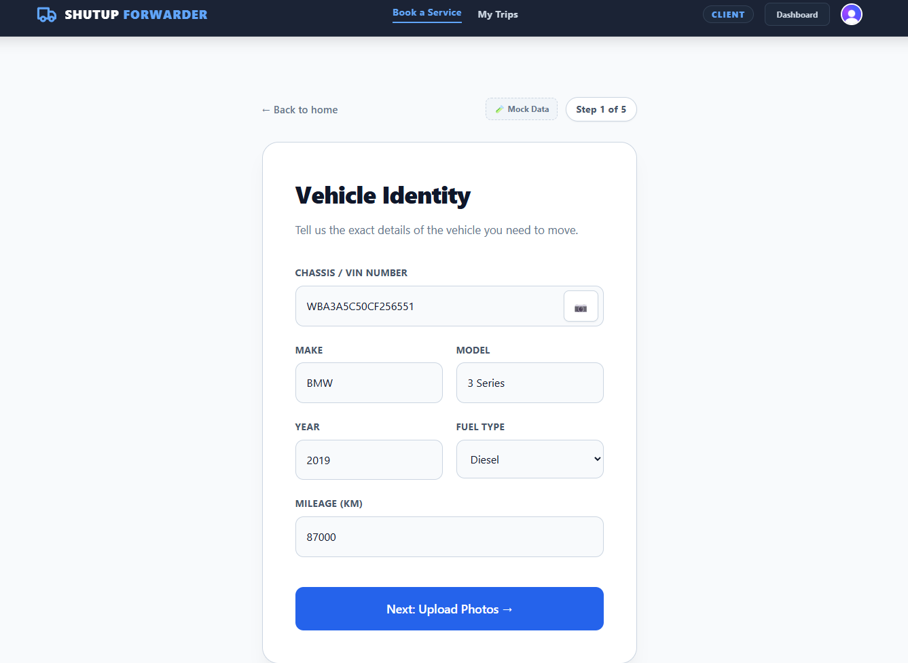
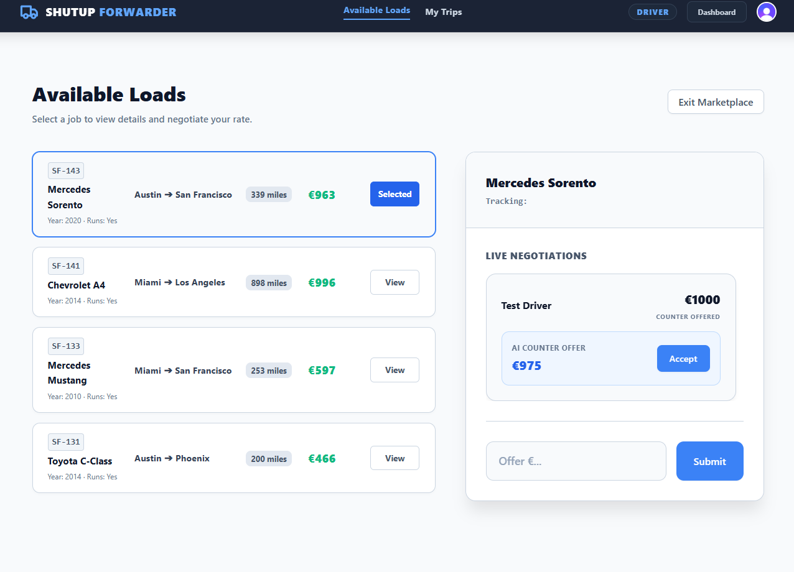

# ShutUP Forwarder — AI-Powered Car Transport Marketplace


## Introduction

ShutUP Forwarder is a fully agentic AI-powered car transport marketplace built on SvelteKit. The platform connects customers who need vehicles transported with forwarders (drivers) who can fulfill those requests. 

Instead of relying on human brokers, the platform uses AI agents to automate dispatch, pricing, negotiation, compliance, and delivery verification. The entire application logic, database access, and AI orchestration are built natively into SvelteKit using the Vercel AI SDK and Groq for blazing fast inference.

## The Workflow

1. **Job Submission:** A customer submits a transport job including vehicle details, photos, pickup, and delivery addresses.
2. **AI Intake Validation:** The **Intake Agent** automatically evaluates the job details, extracting metadata and assessing complexity to generate a target budget.
3. **Driver Bidding:** Drivers view available loads on the marketplace dashboard and submit bids for the transport job.
4. **AI Broker Negotiation:** The **Broker Agent** acts as an elite freight broker. It instantly evaluates driver bids against the target budget:
   - **Accepts** bids within the budget limit.
   - **Rejects** outrageously high bids.
   - **Counter-offers** dynamically to negotiate drivers down toward the target budget.
5. **Job Tracking:** Once a bid is finalized and accepted, the job moves to an active state. The driver uses the active load tracker to capture pickup and delivery photos.
6. **Completion:** Upon successful delivery verification, the negotiated payout is finalized and recorded in the driver's history.


## Screenshots


### Customer Dashboard


### Driver Marketplace & Bidding


### Active Load Tracker


## Tech Stack

- **Frontend & Backend:** SvelteKit (Full-stack meta-framework)
- **AI Orchestration:** Vercel AI SDK
- **LLM Provider:** Groq (Llama models)
- **Database:** PostgreSQL (via Prisma ORM)
- **Styling:** Tailwind CSS

---

## Guide to Run this Codebase

### Prerequisites
- Node.js (v18+)
- A PostgreSQL database (e.g., local Postgres, Supabase, Neon)
- Groq API Key

### 1. Setup Environment Variables
Navigate to the `frontend` directory and set up your `.env` file:
```bash
cd frontend
cp .env.example .env
```
Ensure the following variables are populated in your `.env` file:
```env
DATABASE_URL="your-postgres-connection-string"
GROQ_API_KEY="your-groq-api-key"
```

### 2. Install Dependencies
```bash
npm install
```

### 3. Database Setup (Prisma)
Initialize the database schema using Prisma:
```bash
# Push the schema to your database
npx prisma db push

# Generate the Prisma Client
npx prisma generate
```

### 4. Run the Development Server
```bash
npm run dev
```

The application will now be running at `http://localhost:5173`. Open your browser and start testing!

---

## Deployment (Vercel)

Deploying to Vercel is seamless since the project is built natively on SvelteKit. You can easily link a Postgres database using Vercel's built-in Storage integrations.

### 1. Import to Vercel
- Push your code to a GitHub repository.
- Go to your Vercel Dashboard, click **Add New...** > **Project**.
- Import your repository. The framework preset should automatically be detected as **SvelteKit**.
- Set the Root Directory to `frontend` if the `package.json` isn't in the absolute root of the repository.

### 2. Configure Vercel Storage (Neon Postgres)
You do not need to manually provision a database elsewhere. Vercel has native Neon Postgres integration:
1. In your Vercel project, navigate to the **Storage** tab.
2. Click **Create Database** and select **Postgres** (powered by Neon).
3. Follow the prompts to create the database. 
4. Once created, Vercel will automatically inject the `POSTGRES_PRISMA_URL` and `POSTGRES_URL_NON_POOLING` environment variables into your project!

### 3. Add Groq API Key
- Go to the **Settings** tab in your Vercel project, then to **Environment Variables**.
- Add a new variable named `GROQ_API_KEY` and paste your key.

### 4. Deploy and Push Schema
- Trigger a deployment (or let Vercel finish its initial build).
- Once the deployment succeeds, you need to push the Prisma schema to your newly created Vercel Postgres database. From your local machine, link to your Vercel project and run:
```bash
# Pull Vercel environment variables down to your local machine
npx vercel env pull .env.development.local

# Push the Prisma schema to the Vercel remote Neon database
npx prisma db push
```

Your AI-powered transport marketplace is now live on the edge!
